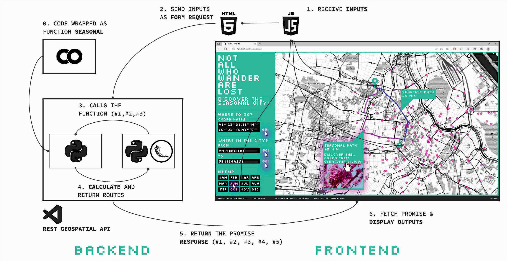

<!-- PROJECT -->

<h2 align="center">UNRAVELING THE SEASONAL CITY !</h2>
    

    <strong>UNRAVELING THE SEASONAL CITY</strong>, is a tool designed to map and discover alternative pedestrian routes on the city based on the seasonality of the urban forest, providing the user with paths featuring the greatest number of trees in flowering period at each month of the year and displaying information about the benefits the different species bring to the urban environment. 
     
  

<!-- INDEX -->

  
INDEX

  <ol>
    <li><a href="#manifesto">00. MANIFESTO</a></li>
    <li><a href="#how-to-use">01. HOW TO USE</a></li>
    <li><a href="#workflow">02. WORKFLOW</a></li>
    <li><a href="#case-study">03. CASE STUDY</a></li>
    <li><a href="#corollary">04. COROLLARY</a></li>
    <li><a href="#references">05. REFERENCES</a></li>
    <li><a href="#license">06. LICENSE</a></li>
  </ol>

<!-- MANIFESTO -->
## 00. MANIFESTO
*Urban AI · Classification Model · Graph Theory · Urban Forest · Canopy Cover · Environmental Design*

Multiple studies use AI tools to categorize, classify, and diagnose both the quantity and quality of the urban forest, as the massive and accelerated urbanization of urban areas has significantly reduced the biodiversity of cities and aggravated pollution, health problems, or physical discomfort of their inhabitants. 
Nevertheless, few studies highlight the importance of creating open and shared knowledge about an urban territory to help citizens reclaim public spaces and strengthen communities through interactive tools. Digital environments can promote new forms of awareness that open debates and increase participation to reactivate social ties, improve the efficiency of public services, or alleviate the conflicts that growing urban sprawls are facing nowadays. 
Despite graph theory proving to be a powerful tool for revealing social fractures or measuring access to points of interest (POIs) through topological analyses, routing algorithms have yet to be considered as an opportunity to delve into the species that coexist with us in our cities. 
In most available applications, the routing decision, which selects the optimal path in the network to transfer data from one point to another, was designed prioritizing the vehicle to the detriment of the pedestrian, considering that in this hectic society, time is the only valid variable when a citizen decides to walk. 
The importance of informing, educating, and empowering the community about environmental inequalities seems crucial to encourage people to get involved in local initiatives, such as recovering and protecting the biodiversity of their cities or promoting sustainable alternatives.
Therefore, the question that initiates this research is very simple. As we live intrinsically connected with urban ecosystems, would it be possible to benefit from graph theory to develop a routing algorithm that allows citizens to discover alternative paths to the shortest one, based on the seasonality of the urban forest and depending on the time of the year?

(<a href="#readme-top">back to top</a>)

<!-- HOW TO USE -->
## 01. HOW TO USE

1. Clone the repository.
2. Download the city's network. i.e. The OSMNX library can be used with a Google Colab Notebook to download the complete street network of the desired city and save its nodes and edges as a geopackage. Replace the new files in the "load" folder.
3. Download the trees of the selected city as a shapefile and replace the new file in the "load" folder.
4. Open index.html and, at the beginning of the script, write your Mapbox access token, the desired map style, and center the map on the coordinates of the selected city.
5. Check the installation requirements and libraries specified in the requirements.txt file.
6. Run the app with Python.
7. Follow the instructions defined on the website.

<video src="./load/images/SEASONALCITY.mp4" controls="controls" style="max-width: 100%;">
    Your browser does not support the video tag.
</video>

(<a href="#readme-top">back to top</a>)

<!-- WORKFLOW -->
## 02. WORKFLOW

**DATASET COMPILATION**
*Google Colab · Python · Pandas*

The first step was the creation of a dataset containing the phenological characteristics of as many species as possible. After combining several available databases and cleaning the duplicates, an initial dataset of 537 species present in European urban forests was set up and manually completed with the phenological features (months of flowering) of each item.

**GRAPH DEFINITION**
*Google Colab · Python · Pandas · OSMnx · Geopy · Momepy · Pandana · Matplotlib*

As listed in the following sections, several Python libraries were used to build the graph and routing algorithm. To clarify the purpose of each of them:
· OSMNX: Download the desired city network.
· MOMEPY: Clean the network and ensure its morphological elements can be measured.
· GEOPY: Geocode source and target points and get addresses from coordinates and vice versa.
· PANDANA: Optimize the process of calculating the shortest and weighted route.
· MATPLOTLIB: Plot the routes and evaluate the results before the web deployment process.

To increase routing computation efficiency and simplify the process, the graph definition is divided into two collaborative notebooks. Nevertheless, the same results could be achieved by unifying both of them.
The first notebook is used to preprocess the network data. The **OSMNX** library is used to download the complete street network of the desired city and save its nodes and edges as a geopackage.
The second notebook contains the code that requires the heaviest computational load. First, the required data (street network as .gpkg, tree locations as .shp, and tree dataset as .csv) is loaded, converted to geo-dataframes with **GEOPANDAS** and **MOMEPY**, cleaned of unnecessary information, and re-projected on a CRS that allows measuring in meters.

Second, Input #01 is defined; the variable ‘month’ is encoded to filter the tree dataset accordingly using **PANDAS**. Next, Input #02 and Input #03 are created; an ‘origin’ and a ‘destination’ are geocoded from coordinates to a specific address using **GEOPY**, encoded as variables, and re-projected on the same CRS as the street network.
Then, the shortest and seasonal route functions are built using the **PANDANA** library. For each of them, a graph is created, the ‘origin’ and ‘destination’ established, and snapped to their closest neighbor (node) in the graph. A route is calculated as an array of nodes that is converted to a linestring thanks to SHAPELY.

The main difference between both functions is the parameter used to weight the graph. For the shortest route function, this variable is the total length of the resulting linestring; the shorter the path, the better. However, the intention of the seasonal route function is quite different; the more trees on a street, the better that particular street should be considered as an alternative path. To achieve this, a measure that combines ‘length’ and ‘amount of trees’ is created.
After snapping the tree locations to their closest neighbor (node) in the street graph, the value of the occurrences on each node is attached to the edges geo-dataframe. By using **SCIKITLEARN**, both ‘length’ and the inverse of ‘amount of trees’ (as the routing algorithms use a minimization function) are re-scaled from 0 to 1. Finally, the ‘seasonal’ parameter is defined; it combines the values of ‘length’ and ‘amount of trees’ per edge and multiplies the second of them by Input #04, an integer set by the user to decide how much longer would be desirable to walk from A to B.

**RESULTS EVALUATION**
*Google Colab · Python · Matplotlib*

Before the web deployment process, the success of the graph and routing functions is tested and verified using **MATPLOTLIB** to graphically display the resulting paths (both shortest and seasonal), comparing the PANDANA shortest route with the results provided by Google Maps, and ensuring different results are achieved by modifying the inputs explained in the previous section; month of the year, origin/source, destination/target, and seasonal weight.

**WEB DEPLOYMENT**
*Python · Flask · Mapbox GL JS · Visual Studio Code · HTML · CSS · JavaScript*

The ultimate goal and the biggest challenge of the project was to deploy the routing algorithms previously exposed as a **REST Geospatial API** and display them on an interactive **MAPBOX map**.
For this purpose, a REQUEST and RESPONSE process was established between a FRONTEND architecture based on **HTML** and **JS**, and a BACKEND server based on **PYTHON** and **FLASK**. In the framework of this research, **Visual Studio Code** was chosen as the editor to build the following web application.

After setting up the basic architecture of the web with HTML and CSS, the map object was created with **Mapbox GL JS**, styled, and centered to the desired city. At the same time, the routing algorithms developed in Google Colab were wrapped as a seasonal function in a Python file that, once the three inputs are received, returns the desired five outputs.
On the Frontend, when the user sets an origin and a destination by clicking points on the city map, and sets a month of the year on a slider, the JavaScript file receives the three inputs and sends them as a request through an HTML form.
On the Backend, a main Python file receives the inputs thanks to the Flask framework and calls the seasonal function that encodes the routing algorithms in a secondary Python file, which calculates and returns the outputs to the main Python file.
Once the main Python file receives the output data from the routing algorithm, it is packed as a JSON file before the Backend API can return the response to the Frontend. Finally, the JavaScript file fetches the promise that awaits and displays the five outputs; the shortest route (polyline), the seasonal route (polyline), the origin address (text), the destination address (text), and the seasonal trees (points).

<!-- CASE STUDY -->
## 03. CASE STUDY

To validate the workflow, the city of Seville, Spain, was chosen as a case study. In addition to having its catalog of urban trees updated and available online, the size of the urban environment is small enough to accelerate the process of filtering trees by month and the consequent routing calculation, yet large enough to yield different results when modifying the inputs.

After studying the flowering months of the 209 tree species cataloged in the city, the results are validated in Matplotlib before proceeding to the web deployment process.

(<a href="#readme-top">back to top</a>)

<!-- COROLLARY -->
## 04. COROLLARY

The research presents a method to create routing algorithms in a city based on the seasonality of its urban forest. Furthermore, it allows users to benefit from graph theory to discover alternative paths through an interactive digital tool and to raise awareness of biodiversity loss in their urban environments.
As an initial approach, the results have been satisfactory. However, the strategies chosen for its generation are only applicable if a city has its flora catalog updated. Additionally, other relevant criteria, such as tree age or health, have been excluded from this project due to a lack of available information.
As mentioned in the Dataset Creation section, there was a manual input process in which tree data was completed to include its phenological features. This process, besides being time- and resource-consuming, induces inaccuracy when considering that trees adapt their flowering time to their habitat's specific climate.
In this sense, the attempt to capture and measure biodiversity in an environment highlights the complexity of properly diagnosing the reality of the urban forest without introducing bias. A possible solution to overcome this problem will be to encode other urban features. In particular, the combination of trees, soil type, and climate datasets for each location with its topology in a Machine Learning model that better predicts the blossom time per species.
In any case, the project opens the door to promising future steps to improve the routing algorithms and lead users to a better understanding of the urban landscape. For instance, by displaying the economic and health benefits of urban trees or by predicting optimal native vegetation types that enhance biodiversity within a selected or desired area.
Finally, the refinement of a validation dataset generic enough to be used in several and diverse urban situations poses a significant challenge. As species pass on climate adaptation to their offspring to react to climate change, the validity of the dataset could be easily compromised if not periodically verified.

(<a href="#readme-top">back to top</a>)

<!-- REFERENCES -->
## 05. REFERENCES

 **Precedents/**
 · Bennet, S. (n.d.). OpenTrees. Available at: https://opentrees.org/
 · Butts, K. (n.d.) Point of interest accessibility. Available at: http://kuanbutts.com/2017/08/08/how-to-pdna/
 · Galle, N. (n.d.). Internet of Nature. Available at: https://www.nadinagalle.com/ion
 · Tree equity score. (n.d.). TESA. Available at: https://treeequityscore.org/
 · Toward cities without slums: Topology and the spatial evolution of neighborhoods. (n.d.). Available at: https://www.science.org/doi/10.1126/sciadv.aar4644
 · USDA Forest Service. (n.d.). i-TREECANOPY. Available at: https://canopy.itreetools.org/

 **Dataset sources/**
 · Bennet, S. (n.d.). OpenTrees. Available at: https://opentrees.org/#pos=3.24/51.6/14.05
 · ESA Copernicus Observation Programme. 2018. Urban Atlas. Available at: https://land.copernicus.eu/local/urban-atlas/urban-atlas
2018
 · Mauri, A., Girardello, M., Strona, G. et al. Sci Data 9, 37 (2022). EU-Trees4F, a dataset on the future distribution of
 Europeantreespecies. Available at: https://doi.org/10.1038/s41597-022-01128-5

 **Code/**
 · Arribas-Bel, D., Puga, D. (n.d.). Geographic Data Science for Applied Economists. Available at: http://darribas.org/gds4ae/content/pages/home.html
 

(<a href="#readme-top">back to top</a>)

<!-- LICENSE -->
## 06. LICENSE

**UNRAVELING THE SEASONAL CITY** is a project of IAAC, Institute for Advanced Architecture of Catalonia developed in the Master of Advanced Computation in Architecture and Design 2021/22. 
Student: Lucía Leva 
Faculty: David A. León

(<a href="#readme-top">back to top</a>)

